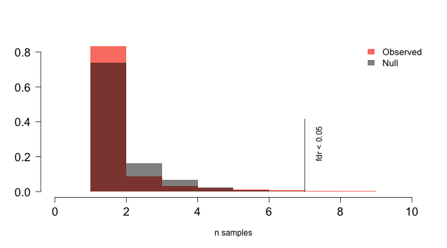
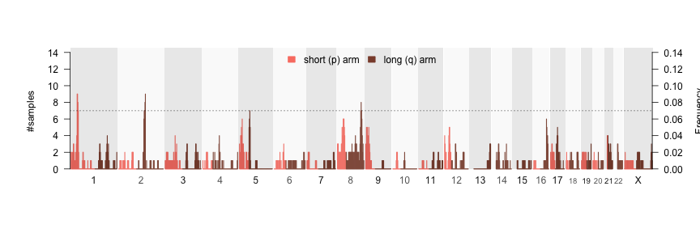
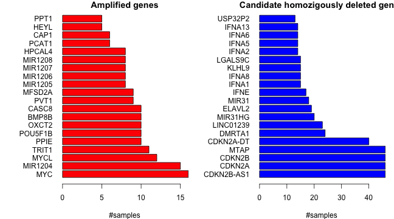
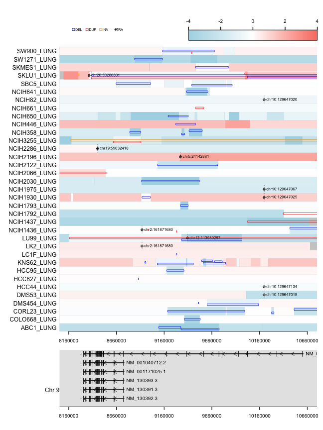

## svpluscnv: R toolkit for the analysis of structural variants and complex genomic rearrangements

`svpluscnv` is an R package designed for integrative analyses of somatic DNA copy number variations (CNV) and other structural variants (SV).`svpluscnv` comprises multiple analytical and visualization tools that can be applied to large datasets from cancer patients such as [TCGA](https://www.cancer.gov/about-nci/organization/ccg/research/structural-genomics/tcga) and [PCAWG](https://dcc.icgc.org/releases/PCAWG) or cancer cell lines [CCLE](https://portals.broadinstitute.org/ccle).
  
CNV data can be derived from genotyping and CGH arrays, as well as next generation sequencing; different segmentation algorithms are used to obtain dosage variations (gains and losses) across the genome. Alternatively, SV calls can be inferred from discordantly aligned reads from whole genome sequencing (WGS) using different algorithms (e.g [manta](https://github.com/Illumina/manta), [lumpy](https://github.com/arq5x/lumpy-sv), etc).
  
Structural Variation Calls (SVC) provide linkage information from discordantly aligned reads and read pairs, allowing the discovery of chromosomal translocations and variants that do not necessarily involve dosage change, such as inversions and other copy number neutral events. CNVs and SVCs produce orthogonal as well as complementary results. The integration of both data types can by highly informative to understand the somatic alterations driving many cancers and is essential to characterize complex chromosomal alterations such as chromothripsis and chromoplexy. However, most currently available cancer genomics datasets incorporate CNV characterization whereas SVs (derived from WGS) are scarcer. For this reason, `svpluscnv` tools implement functions that work with both data types separately as well as integrated. 

The `svpluscnv` package implements analysis and visualization tools to evaluate chromosomal instability and ploidy, identify genes harboring recurrent SVs and systematically characterize hot-spot genomic locations harboring shattered regions such as those caused by chromothripsis and chromoplexia.


## Index:

* [Install svpluscnv](#install-svpluscnv)
* [Input data types](#input-data-types)
* [Initialize data types](#initialize-data-types)
    * [Initialize segmentation data format](#initialize-segmentation-data-format)
    * [Initialize structural variant data format](#initialize-structural-variant-data-format)
* [CNV analysis and visualization](#cnv-analysis-and-visualization)
    * [CNV frequency plot](#cnv-frequency-plot)
    * [Chromosome arm CNV determination](#chromosome-arm-cnv-determination)
* [Assessment of chromosomal instability](#assessment-of-chromosomal-instability)
    * [Percent genome change](#percent-genome-change)
    * [Breakpoint burden analysis](#breakpoint-burden-analysis)
* [Co-localization of breakpoints](#co\-localization-of-breakpoints)
* [Identification of shattered regions](#identification-of-shattered-regions)
    * [Chromosome shattering combining SV and CNV](#chromosome-shattering-using-sv-and-cnv)
    * [Chromosome shattering using CNV data only](#chromosome-shattering-using-cnv-data-only)
    * [Visualization of shattered regions](#visualization-of-shattered-regions)
    * [Recurrently shattered regions](#recurrently-shattered-regions)
* [Recurrently altered genes](#recurrently-altered-genes)
    * [Gene level CNV](#gene-level-cnv)
    * [Recurrently altered genes overlapping with SV and CNV breakpoints](#recurrently-altered-genes-overlapping-with-sv-and-cnv-breakpoints)
    * [Integrated visualization of SVs and CNV in recurrently altered genes](#integrated-visualization-of-svs-and-cnv-in-recurrently-altered-genes)

------------

## Install svpluscnv

Install development version from GitHub

```r
devtools::install_github("ccbiolab/svpluscnv")
```

## Input data types

Two data types are allowed:
  
__CNV segmentation data:__ (cnv data type) 6 columns are required in the following order: `sample`, `chrom`, `start`, `end`, `probes` & `segmean`. Most algorithms studying CNVs produce segmented data indicating genomic boundaries and the segment mean copy number value (segmean); `svpluscnv` assumes CNV expressed as log-ratios: __e.g.:__ $\log2(tumor/normal)$ Those values do not necessarily represent entire copy number states as many samples may contain admixture or subclonal populations.

__Structural Variant calls:__ (svc data type) 8 columns are required in the folowing order: `sample`, `chrom1`, `pos1`, `strand1`, `chrom2`, `pos2`, `strand2` & `svclass`. SV calls are obtained from WGS by identifying reads and read-pairs that align discordantly to the reference genome. The types accepted in the svclass field are: duplication(DUP), deletion(DEL), inversion(INV), insertion(INS), translocation(TRA) and breakend(BND) for undefined variants.
  
All functions accept multiple samples. Functions that make use of both CNV and SV calls expect a common set of ids in the `sample` field.
  
In order to explore the  functionalities of svpluscnv, two datasets have been included with the package:

* [CCLE lung cancer derived cell lines](https://depmap.org/portal/download/); Two data.frames contain information about CNV segments and structural variants respectively:
    * `svpluscnv::segdat_lung_ccle`
    * `svpluscnv::svdat_lung_ccle`
* [TARGET neuroblastoma dataset](https://ocg.cancer.gov/programs/target) based on Complete Genomics WGS and structural variant calls:
    * `svpluscnv::nbl_segdat`
    * `svpluscnv::nbl_svdat`  
Both datasets are `lazy` loaded with `svpluscnv`


```r
library(svpluscnv)
head(nbl_segdat)
```

```
##   Sample Chromosome    Start      End Num_markers  Seg_CN
## 1 PAISNS          1    11000   833000         337 -0.0270
## 2 PAISNS          1   835000  2715000         916 -1.0257
## 3 PAISNS          1  2717000  5969000        1552 -0.8316
## 4 PAISNS          1  5971000 12481000        3256 -0.9593
## 5 PAISNS          1 12483000 12777000         148 -0.2305
## 6 PAISNS          1 12779000 15551000        1287 -0.0083
```

```r
head(nbl_svdat)
```

```
##   TARGET.USI LeftChr LeftPosition LeftStrand RightChr RightPosition RightStrand Type
## 1     PAISNS    chr1     12481576          -     chr7     123358964           +  TRA
## 2     PAISNS    chr1    120543859          -     chr2      65103235           -  TRA
## 3     PAISNS    chr2    231680218          +    chr21      40045998           +  TRA
## 4     PAISNS    chr3     54814482          -    chr17      42657036           +  TRA
## 5     PAISNS    chr4     97761321          -     chr4      97765146           +  INV
## 6     PAISNS    chr4    190936134          +     chr9      68411170           +  TRA
```

## Initialize data types

* `validate.cnv()` segmentation data.frame parser
* `validate.svc()` structural variant data.frame parser

### Initialize segmentation data format

Validates and reformat CNV segmentation `data.frame` to be used by svpluscnv tools


```r
cnv <- validate.cnv(nbl_segdat)
cnv
```

```
## An object of class svcnvio from svpluscnv storing cnv data from 135 samples
```


### Initialize structural variant data format 

Validates and format structural variant `data.frame` to be used by svpluscnv tools


```r
svc <- validate.svc(nbl_svdat)
svc
```

```
## An object of class svcnvio from svpluscnv storing svc data from 135 samples
```

## CNV analysis and visualization

### CNV frequency plot
Visualization of CNV gain/loss frequencies across the genome; aggregates samples for a given genomic window size, which copy number log-ratio differs from 0. The threshold `fc.pct` is represented as percentage (e.g. 0.2 -> 20% fold change compared to the reference). 
If the dataset represents samples with hyperploidy, the plot would be skewed. Therefore, the possibility of ploidy correction is included; `svpluscnv` implements the function `med.segmean` that returns per sample median logR (segmean) value, which can be substracted from each sample segment's logR. This correction can be called internally by `cnv.freq` using `ploidy=TRUE` argument.


```r
cnv_freq <- cnv.freq(cnv, fc.pct = 0.2, ploidy = FALSE, plot=TRUE)
```


```r
cnv_freq
```

```
## An object of class cnvfreq from svpluscnv containing the following stats:
##                 
## Number of samples= 135 
## Number of genomic bins = 3022
```

### Chromosome arm CNV determination

The function `chr.arm.cnv` obtains the segment weighted average log-ratios for each chromosome arm in each sample; it returns a matrix formated output.


```r
charm.mat <- chr.arm.cnv(cnv, genome.v = "hg19", verbose = FALSE)
# heatmap plot of chromosome arm level CNV
require(gplots,quietly = TRUE,warn.conflicts = FALSE)
heatmap.2(charm.mat[order(rownames(charm.mat))[1:42],],Rowv=NA,trace='none',cexCol=.5, lhei=c(0.25,1), dendrogram='col', key.title="Copy number",
        col=colorRampPalette(c("blue","white","red"))(256))
```


## Assessment of chromosomal instability

Chromosomal instability (CIN) is common in cancer and has a fundamental pathogenic role. CNV profiles allow quantification of these events by evaluating the percentage of the genome's copy number logR differing from normal or the total burden of genomic alterations in a given sample:

### Percent genome change

Per sample measure of genome instability; calculates what percentage of the genome's copy number log2-ratio differs from 0 (aka. diploid for autosomal chromosomes) above a certain threshold. 


```r
# ploidy correction
pct_change <- pct.genome.changed(cnv, fc.pct = 0.2)
head(pct_change)
```

```
##       PAISNS       PAIVZR       PAIXFZ       PAKZRH       PALKXJ       PALNVP 
## 0.2449286786 0.0439952736 0.0003125753 0.0004199808 0.4302685820 0.2972370088
```

### Breakpoint burden analysis

In addition to percentage of genome changed, we can measure the total burden of breakpoints derived from CNV segmention and SV calls. Both the percent genome change and breakpoint burden measures are expected to show positive correlation as shown below.


```r
# define breakpoints from svc data
svc_breaks  <- svc.breaks(svc)  
# define breakpoints from cnv data based on certain CNV log-ratio change cutoff
cnv_breaks  <- cnv.breaks(cnv,fc.pct = 0.2,verbose=FALSE)  

# scatter plot comparing cnv and svc breakpoint burden and percent genome changed, for a set of common samples
common_samples <- intersect(names(svc_breaks@burden),names(cnv_breaks@burden))
dat1 <- log2(1+cbind(svc_breaks@burden[common_samples],
                    cnv_breaks@burden[common_samples]))
dat2 <- log2(1+cbind(pct_change, 
                     cnv_breaks@burden[names(pct_change)]))
par(mfrow=c(1,2))
plot(dat1, xlab="log2(1+SV break count)", ylab="log2(1+CNV break count)")
legend("bottomright",paste("Spearman's cor=",sprintf("%.2f",cor(dat1,method="spearman")[1,2]), sep=""))
plot(dat2, xlab="percentage genome changed", ylab="log2(1+CNV break count)")
legend("bottomright",paste("Spearman's cor=",sprintf("%.2f",cor(dat2,method="spearman")[1,2]), sep=""))
```


## Co-localization of breakpoints

Both CNV segmentation profiles and SV calls produce orthogonal results for variants that involve CN dosage changes. The function `match.breaks` compares the breakpoints derived from both approaches by identifying their co-localizing. It takes two objects of class `breaks` returned by either `svc.breaks` or `cnv.breaks` function. Thus, it may be used to compare also two sets of CNV breakpoints obtained from different algorithms or SV callers.


```r
common.breaks <- match.breaks(cnv_breaks, svc_breaks, 
                              maxgap=100000, 
                              verbose=FALSE,
                              plot = TRUE)
```


## Identification of shattered regions

Complex chromosomal rearrangements such as chromothripsis and chromoplexy are widespread events in many cancers and may have important pathogenic roles. `svpluscnv` incorporates tools to map and visualize shattered regions across multiple samples.

We used LUNG cancer cell line profiles from the CCLE in order to illustrate these tools:

Validate CNV (cnv) and SV call (svc) data.frames

```r
# It is important to make sure the input data.frame has no factors
library(taRifx)
segdat_lung_ccle <- remove.factors(segdat_lung_ccle)
svdat_lung_ccle <- remove.factors(svdat_lung_ccle)
cnv <- validate.cnv(segdat_lung_ccle)
# remove likely artifacts from segmentation data and fill gaps in the segmentation data (optional)
cnv_clean <- clean.cnv.artifact(cnv, verbose=FALSE,n.reps = 4,fill.gaps = TRUE)  
svc <- validate.svc(svdat_lung_ccle)
```

### Chromosome shattering combining SV and CNV 

1) Identification of genomic bins with high density of breakpoints
    * The genome is binned into 10Mb windows (`window.size == 10`) and slide into 2Mb (`slide.size == 2`).
    * Breakpoints are defined using `cnv.breaks` (CNV), `svc.breaks` (SV) and `match.breaks` (common) and then mapped into bins; minimum thresholds are set using `num.cnv.breaks = 6`, `num.svc.breaks = 6` and `num.common.breaks = 3` respectively.
    * The number of breaks must be of shattered regions are spected to be out-liers therefor the n times above the average in each sample can be defined using `num.cnv.sd = 5`, `num.svc.sd = 5` and `num.common.sd = 0`

2) Identification of shattered regions
    * Contiguous bins with high density of breakpoints are collapsed into shattered regions
    * To discard complex focal events such as circular amplifications or double minutes, the interquartile average of the distances between breaks is set to `dist.iqm.cut = 150000`.
    * Finally, shattered regions such as chromothripsis and chromoplexy produce interleaved SVs. We set the percentage of interleaved SVs with `interleaved.cut = 0.33` to discard regions with less than 33% interleaved variants.

(more info `?shattered.regions`)


```r
shatt_lung <- shattered.regions(cnv, svc, fc.pct = 0.1, verbose=FALSE)
shatt_lung
```

```
## An object of class chromo.regs from svpluscnv containing the following stats: 
## Number of samples tested= 97 
## Number of samples with shattered regions= 77 
## Number of samples with high-confidence shattered regions= 69 
## Number of samples with low-confidence shattered regions= 34
```

### Chromosome shattering using CNV data only

A simplified version of `shattered regions` uses only CNV segmentation data, which is available more often and in larger datasets. The `shattered.regions.cnv` follows the same approach but disregards parameters that are only available for SV data.


```r
# our example data is derived from cell lines and may contain germline common CNVs, for this reason we use the filtered version 'cnvdf_clean' obtained above
shatt_lung_cnv <- shattered.regions.cnv(cnv_clean, fc.pct = 0.1, verbose=FALSE)
shatt_lung_cnv
```

```
## An object of class chromo.regs from svpluscnv containing the following stats: 
## Number of samples tested= 185 
## Number of samples with shattered regions= 182 
## Number of samples with high-confidence shattered regions= 179 
## Number of samples with low-confidence shattered regions= 103
```
 
### Visualization of shattered regions

Circos plotting is available via [circlize](https://cran.r-project.org/web/packages/circlize/index.html) package wrapper function  `circ.chromo.plot`, which takes an object generated by `shattered.regions` function. The circular plot represents (inward to outward): Structural variants, CNVs, shattered regions (purple) and the ideogram. 


```r
# plotting functions are available for whole genome and chromosomes with shattered regions (both combined CNV and SV and CNV only) 
par(mfrow=c(1,3))
circ.wg.plot(cnv,svc,sample.id = "SCLC21H_LUNG")
circ.chromo.plot(shatt_lung_cnv,sample.id = "SCLC21H_LUNG")
circ.chromo.plot(shatt_lung,sample.id = "SCLC21H_LUNG")
```


### Recurrently shattered regions

To establish whether certain regions suffer chromosome shattering above expectation, we evaluate the null hypothesis that shattered regions occur throughout the genome at random; To this end we first create an empirical null distribution based on the sample set under study. The null is then compared with the observed distribution (`shatt_lung_cnv$high.density.regions.hc`) to obtain empirical adjusted p-values. The bins with corrected p-values deemed statistically significant define regions under selection pressure for chromosome shattering. Since the genomic bins might span low coverage regions where no CNV or SVs are mapped we removed remove bins with frequency = 0 setting the `zerofreq=TRUE`.


```r
set.seed<-1234
null.test <- freq.p.test(shatt_lung@high.density.regions.hc, 
                         method="fdr", p.cut = 0.05)
```



\We can visualize the aggregate map of shattered regions for all samples with `shattered.map.plot`. The peaks that rise above `null.test$freq.cut` define recurrently shattered regions


```r
shattered.map.plot(shatt_lung, freq.cut = null.test@freq.cut)
```



And finally collect groups of samples with recurrent shattered regions as defined by the empirical test described above. 


```r
# obtain genomic bins within above the FDR cutoff
hotspots <- hot.spot.samples(shatt_lung, freq.cut=null.test@freq.cut)
hotspots$peakRegionsSamples
```

```
## $`chr1 34061735 44061735`
## [1] "COLO668_LUNG"  "CORL88_LUNG"   "NCIH1092_LUNG" "NCIH2122_LUNG" "NCIH510_LUNG"  "NCIH520_LUNG"  "NCIH889_LUNG" 
## 
## $`chr2 140012784 150012784`
## [1] "DMS454_LUNG"   "HARA_LUNG"     "HCC95_LUNG"    "NCIH1339_LUNG" "NCIH460_LUNG"  "NCIH520_LUNG"  "NCIH838_LUNG" 
## 
## $`chr8 128031254 138031254`
## [1] "CORL23_LUNG"   "CORL311_LUNG"  "HCC44_LUNG"    "HCC827_LUNG"   "NCIH1869_LUNG" "NCIH2122_LUNG" "NCIH510_LUNG"  "SCLC21H_LUNG"
```

Beyond this point the user can test case/control hipothesys for chromosome shattering of specific genomic regions within the dataset under study.


## Recurrently altered genes

Somatic pathogenic variants are characterized by presenting in recurrent patterns. Evaluating the recurrence of structural variations involve challenges as their interpretation more complicated than other variant types (e.g. SNVs). We evaluate the recurrence of structural variants using two criteria: dosage changes at the gene level and analysis of breakpoints overlapping with known genes.

### Gene level CNV

The function `gene.cnv` generates a matrix with gene level CNVs from a segmentation. The gene CNV matrix can be queried using `amp.del` to obtain the ranking of amplifications and deep deletions.


```r
# obtain gene level CNV data as the average log ratio of each gene's overlapping CNV segments
genecnv_data <- gene.cnv(cnv_clean, genome.v = "hg19",fill.gaps = FALSE,verbose=FALSE)
# retrieve amplifications and deep deletion events using a log-ratio cutoff = +- 2
amp_del_genes <- amp.del(genecnv_data, logr.cut = 2)
```

The output of the function `amp.del` contains a ranking of genes based on the number of amplification and deletion events as well as lists containing the sample ids that can be used to build oncoprints or other visualizations. We can simply visualize the top of the ranking as below:


```r
par(mfrow=c(1,2),mar=c(4,7,1,1))
barplot(amp_del_genes$amplified.rank[1:20],col="red",
        las=1,main="Amplified genes",horiz=TRUE,xlab="#samples")
barplot(amp_del_genes$deepdel.rank[1:20],col="blue",
        las=1,main="Candidate homozigously deleted genes",horiz=TRUE,xlab="#samples")
```




### Recurrently altered genes overlapping with SV and CNV breakpoints

Instead of focusing on high-level dosage changes, we evaluate whether CNV breakpoints overlap with known genes or upstream regions (gene level CNVs are studied [above](#gene-level-cnv)). `cnv.break.annot` evaluates segmentation data and returns a list of genes and associated breakpoints that can be retrieved for further analyses. In addition every gene is associated via list to the sample ids harboring the variants.


```r
results_cnv <- cnv.break.annot(cnv, fc.pct = 0.2, genome.v="hg19",clean.brk = 8,upstr = 100000,verbose=FALSE)
```
SV calls do not incorporate dosage information, therefore we study the localization of breakpoints with respect to known genes. The annotation identifies small segmental variants overlapping with genes. For translocations (TRA) and large segmental variants (default > 200Kb) only the breakpoint overlap with genes are considered. `svc.break.annot` returns a list of genes and associated variants that can be retrieved for further analyses. In addition, every gene is associated via list to the sample ids harboring variants.


```r
results_svc <- svc.break.annot(svc, svc.seg.size = 200000, genome.v="hg19",upstr = 100000, verbose=FALSE)
```

We can then integrate results obtained from scanning SV and CNV breks using the 'merge2lists' function 

```r
# intersect elements from two lists
disruptSamples <- merge2lists(results_cnv@disruptSamples,results_svc@disruptSamples, fun="intersect")
upstreamSamples <- merge2lists(results_cnv@upstreamSamples,results_svc@upstreamSamples, fun="intersect")
# plot a ranking of recurrently altered genes
par(mar=c(5,10,1,1),mfrow=c(1,2))
barplot(rev(sort(unlist(lapply(disruptSamples,length)),decreasing=TRUE)[1:20]),horiz=TRUE,las=1)
barplot(rev(sort(unlist(lapply(upstreamSamples,length)),decreasing=TRUE)[1:20]),horiz=TRUE,las=1)
```


### Integrated visualization of SVs and CNV in recurrently altered genes

Integrating segmentation and SV calls is critical to understand the role of structural variants in recurrently altered genes. `svpluscnv` includes an integrated visualization tool `sv.model.view` that overlays data from CNV segmentation data and SV calls. This function allows to glance all variants affecting a specified genomic region (e.g. gene locus). This functionality is complemented with a genomic track plot function (`gene.track.view`) that can be used to build layouts; The `gene.track.view` function can also be used to retrieve information about isoforms and exonic regions of each gene.


```r
# we use method gene.symbol.info to obtain the genomic coordinates of our gene of interests PTPRD (one of the top altered genes shown above)
refSeqGene <- gene.symbol.info(refseq_hg19,"PTPRD")
chrom <- refSeqGene$chrom
start <- refSeqGene$start - 150000
stop <- refSeqGene$stop + 50000
#  The function `sv.model.view` has builtin breakpoint search capabilities. 
# The argument 'sampleids' allows selecting the list of samples to be show; if null, 
# samples with breakpoints will be searched in the defined genomic region
# In this case we are using the list of samples with SV breakpoints disrupting PTPRD as determined with `svc.break.annot`
sampleids <- sort(results_svc@disruptSamples[["PTPRD"]])
# We build a layout to combine `svc.model.view` and `gene.track.view` using the same set of genomic coordinates
layout(matrix(c(1,1,2,2),2,2 ,byrow = TRUE),heights = c(8,2))
par(mar=c(0,10,1,1))
sv.model.view(cnv, svc, chrom, start, stop, sampleids=sampleids, 
              addlegend = 'both', addtext=c("TRA"), cnvlim = c(-2,2), 
              cex=.7,cex.text =.8, summary = FALSE)
gene.track.view(chrom=chrom ,start=start, stop=stop, addtext=TRUE, cex.text=1, 
                summary = FALSE)
```




