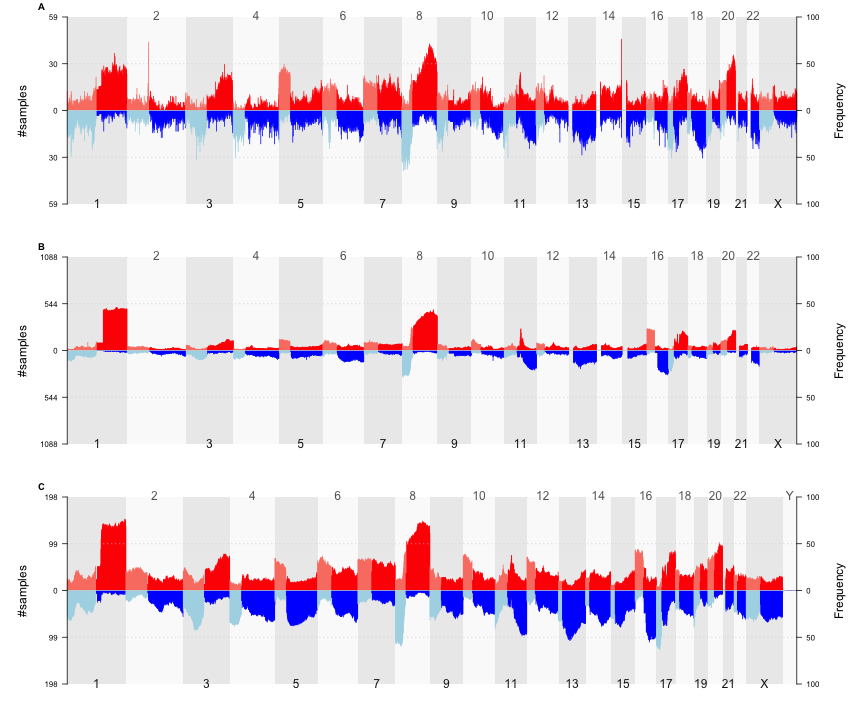
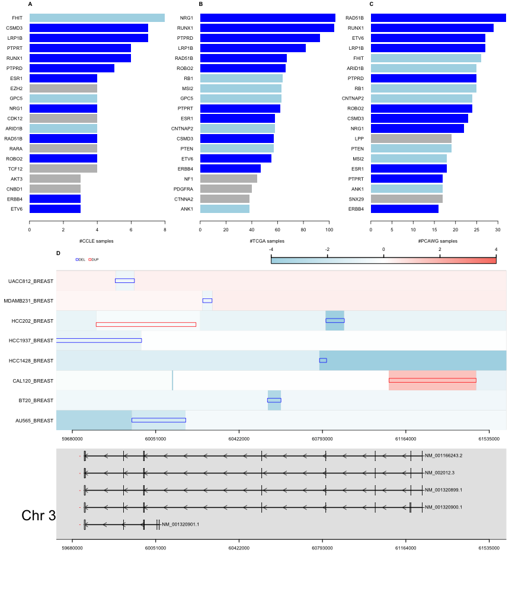
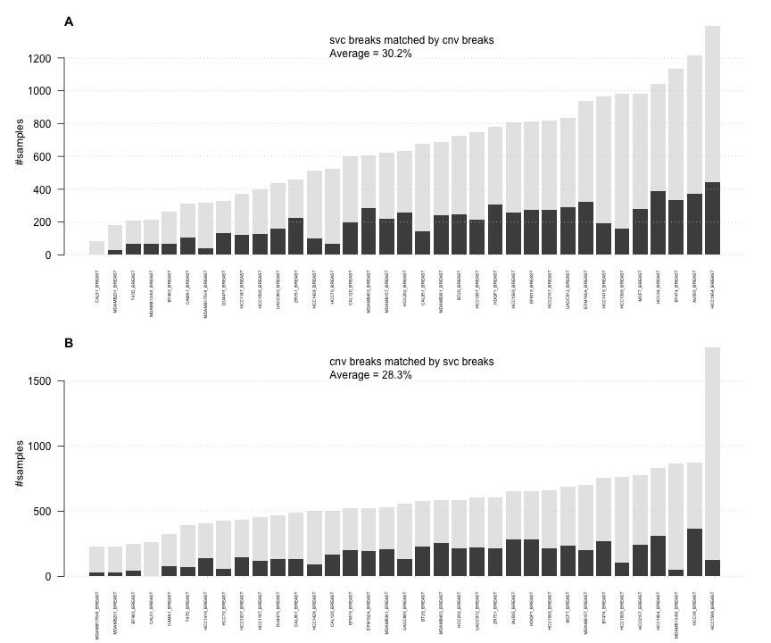
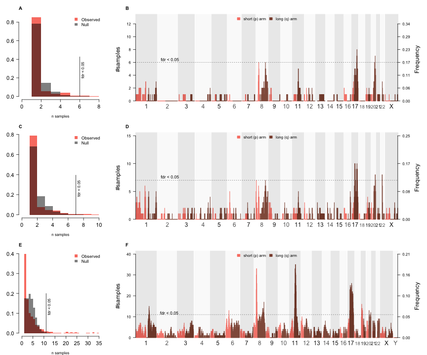

<script type="text/javascript">
document.addEventListener("DOMContentLoaded", function() {
  document.querySelector("h1").className = "title";
});
</script>
<script type="text/javascript">
document.addEventListener("DOMContentLoaded", function() {
  var links = document.links;  
  for (var i = 0, linksLength = links.length; i < linksLength; i++)
    if (links[i].hostname != window.location.hostname)
      links[i].target = '_blank';
});
</script>
<style type="text/css" scoped>
body {
  margin: 0px auto;
  max-width: 1134px;
  font-family: sans-serif;
  font-size: 10pt;
}

/* Table of contents style */

div#TOC ul {
  padding: 0px 0px 0px 45px;
  list-style: none;
  background-image: none;
  background-repeat: none;
  background-position: 0;
  font-size: 10pt;
  font-family: Helvetica, Arial, sans-serif;
}

div#TOC > ul {
  padding: 0px 150px 0px 65px;
  font-size: 12pt;
}

div#TOC > ul > li {
  padding: 5px 0px 0px 0px;
}

div#TOC ul ul {
  font-size: 11pt;
}

div#TOC.tocify ul {
  padding: 0px;
  font-size: inherit;
  font-family: inherit;
}

div#TOC.tocify li {
  padding: 5px;
  font-size: inherit;
  font-family: inherit;
}

p, dl {
  padding: 0px 150px 0px 65px;
  text-align: justify;
}

/* vertical content spacing */
p, img, table {
  margin-top: 10px;
  margin-bottom: 10px;
}

/* lists */
ol, ul {
  padding: 0px 150px 0px 100px;
  list-style: square;
}

li ol, li ul {
  padding: 0px 0px 0px 35px;
}

li p {
  padding: 0;
}

pre {
  margin: 0em 150px 0.5em 0em;
  padding: 0px 0px 0px 65px;
  border: 0px none;
  background-color: #f0f0f0;
  white-space: pre;
  overflow-x: auto;
  font-size: 90%;
}

li pre {
  margin: 0em 0px 0.5em -65px;
  padding: 0px 0px 0px 65px;
}
pre code {
  background-color: inherit;
  display: block;
  padding: 10px 10px 10px 0px;
  overflow-x: inherit;
  font-size: 100%;
}

/* markdown v1 */
pre code[class] {
  background-color: inherit;
}

/* markdown v2 */
pre[class] code {
  background-color: inherit;
}

tt, code, pre {
   font-family: 'DejaVu Sans Mono', 'Droid Sans Mono', 'Lucida Console', Consolas, Monaco, monospace;
}

h1, h2, h3, h4, h5, h6 { 
  font-family: Helvetica, Arial, sans-serif;
  margin: 1.2em 150px 0.6em 0em;
/* hanging headings */
  padding-left: 65px;
  text-indent: -65px;
}

h1.title {
  color: #87b13f;
  line-height: 1.1em;
  margin-top: 25px;
  border-bottom: 0px;
}

h1 {
  line-height: 1.4em;
  border-bottom: 1px #1a81c2 solid;
}

h1, h2, h3 {
  color: #1a81c2;
}

h1 {
  font-size: 18.0pt;
}

h2 {
  font-size: 14.5pt;
}

h3, h4 {
  font-size: 12pt;
}

span.header-section-number {
  float: left;
  width: 65px;
}

/* document header */

p.author-name {
  font-size: 14.5pt;
  font-weight: bold;
  font-style: italic;
  text-align: left;
}

.date {
  text-indent: 0px;
  font-weight: bold;
}

.abstract, .package {
  font-weight: bold;
}

/* formatting of inline code */
code { 
  background-color: #f0f0f0;
  color: #404040;
  font-size: 90%;
}

/* figures */

.figure { 
  margin: 0em 0px 0.5em;
}

img {
  max-width: 100%;
  display: block;
  padding: 0px 150px 0px 130px;
}

p > img {
  padding-left: 65px;
  padding-right: 0px;
}

img.smallfigure {
  padding-left: 195px;
  padding-right: 280px;
}

p > img.smallfigure {
  padding-left: 130px;
  padding-right: 130px;
}

img.widefigure {
  padding-left: 65px;
  padding-right: 85px;
  margin-right: -65px;
}

p > img.widefigure {
  padding-left: 0px;
  padding-right: 0px;
  margin-right: -65px;
}

p.caption, caption {
  color: inherit;
  font-size: 8pt;
}

p.caption {
  padding-left: 130px;
  padding-right: 85px;
  margin-bottom: 20px;
}

caption {
  padding: 0px;
  margin-bottom: 10px;
  min-width: 583;
}
span.caption-title {
  color: #1a81c2;
  font-weight: bold;
}

span.caption-label {
  font-weight: bold;
}

/* tables */

table {
  margin-left: 130px;
  margin-right: 85px;
}

.table {
  max-width: 518px;
}

/* definition lists */

dd {
  margin-left: 65px;
  margin-bottom: 10px;
}

/* code folding buttons */

.code-folding-btn {
  position: relative;
  margin-top: -26px;
  top: 26px;
}

.col-md-12 {
  min-height: 0px;
}

/* footnotes as sidenotes */

.sidenote {
  float: right;
  clear: right;
  margin-right: -150px;
  width: 130px;
  margin-top: 0;
  margin-bottom: 1rem;
  font-size: 8pt;
  line-height: 1.3;
  vertical-align: baseline;
  position: relative;
  text-align: left;
}

.sidenote-number, .affil-mark {
  position: relative;
  vertical-align: super;
  font-size: 7.5pt;
  font-weight: normal;
  font-style: normal;
  line-height: normal;
}

input.margin-toggle { display: none; }

label.sidenote-number { display: inline; }

label.margin-toggle:not(.sidenote-number) { display: none; }

/* Class described in https://benjeffrey.com/posts/pandoc-syntax-highlighting-css
   Colours from https://gist.github.com/robsimmons/1172277 */

code > span.kw { color: #E07020; } /* Function calls */
code > span.dt { color: #404040; } /* Function args */
code > span.dv { color: #D02070; } /* DecVal (decimal values) */
code > span.bn { color: #d14; } /* BaseN */
code > span.fl { color: #D02070; } /* Float */
code > span.ch { color: #40A040; } /* Char */
code > span.st { color: #40A040; } /* String */
code > span.co { color: #808080; font-style: italic; } /* Comment */
code > span.ot { color: #2020F0; } /* Keywords */
code > span.al { color: #ff0000; font-weight: bold; } /* AlertToken */
code > span.fu { color: #E07020; } /* Function calls */ 
code > span.er { color: #FF0000; } /* ErrorTok */

code > span.identifier { color: #404040; }
code > span.number { color: #D02070; }
code > span.string { color: #40A040; }
code > span.comment { color: #808080; font-style: italic; }
code > span.keyword { color: #2020F0; }
code > span.literal { color: #2020F0; }
code > span.operator { color: #000000;}
code > span.paren { color: #000000;}

/* proper positioning of ggplotly graphics, see https://support.bioconductor.org/p/97609/ */

.js-plotly-plot .plotly {
  padding-left: 65px;
}
</style>


# Comparative analysis of orthogonal Breast Cancer datasets
### svpluscnv: analysis and visualization of complex structural variation data
#### Gonzalo Lopez, Laura E. Egolf, Federico M. Giorgi, Sharon J. Diskin, and Adam A. Margolin


## Table of Contents:

* [Introduction](#introduction)
* [Source of datasets used along this study](#source-of-datasets-used-along-this-study)
* [Genome-wide visualization of CNV frequencies](#genome-wide-visualization-of-cnv-frequencies)
* [Identification and visualization of recurrently altered genes](#identification-and-visualization-of-recurrently-altered-genes)
* [Co-localization of breakpoints across orthogonal datasets](#co-localization-of-breakpoints-across-orthogonal-datasets)
* [Identification of shattered regions](#identification-of-shattered-regions)
* [Localization of shattered region hot spots in breast cancer](#localization-of-shattered-region-hot-spots-in-breast-cancer)
* [References](#references)


## Introduction

The svpluscnv R package is designed for integrative analyses of somatic DNA copy number variations (CNV) and structural variants calls (SVC) derived from WGS discordant alignments to the reference genome in tumor/normal paired studies. svpluscnv comprises multiple analytical and visualization tools that can be applied to large datasets from cancer patients as well as cell lines. The whole code is written in R and it takes advantage of the algebra of genomic ranges implemented in the GenomicRanges package (Lawrence, et al., 2013) as well as Circular plotting implemented in Circlize package (Gu, et al., 2014). The package also makes use of genomic annotations including cytogenetic bands and gene RefSeq annotations obtained from  UCSC table browser (Karolchik, et al., 2004). Currently, two genome versions are supported: hg19/GRCh37 and hg38/GRCh38.

## Source of datasets used along this study

We used 3 genomics data sources throughout this manuscript, all of which are encoded in the hg19/GRCh37 coordinate system; the three datasets allow a variety of usage modes depending on data availability:
* Breast Cancer Cell line genomic data from CCLE (Ghandi, et al., 2019) organized by DepMap repository (https://depmap.org/portal/download/) includes CNVs and SVC from orthogonal sources:
    * SVC somatic SVs derived from 35 WGS sequenced cell lines were obtained from release 19Q2 (file name: CCLE_translocations_SvABA_20181221.csv.gz).
    * CNV profiles from release CCLE_copynumber_2013-12-03; we used the SNP6.0 arrays from 59 cell lines from the legacy version since the most recent releases included CNV profiles derived from different platforms that introduced considerable batch effect (data not shown).

* TCGA data from Breast Cancer (brca) 1088 primary tumors were obtained from the hg19 GDC legacy archive (https://portal.gdc.cancer.gov/legacy-archive/). Profiles were derived from SNP6.0 arrays. This is the largest dataset, but only CNV data are available.

* The PCAWG worldwide consortium for the analysis of cancer whole genomes (Consortium, 2020) comprises 198 Breast-Adenocarcinomas. These data derive from WGS and were downloaded from the consortium repository pages (https://dcc.icgc.org/releases/PCAWG). Although both CNV and SVC are available the source is not considered orthogonal:
	* SVC data were obtained from the consensus_sv folder and reformatted as svpluscnv input format. 
	* CNV segmentation profiles were derived from the file consensus.20170119.somatic.cna.annotated.tar.gz. In order to recreate logR values the consensus ‘total_cn’ CNV call was transformed: first, we added white noise (μ = 0; σ = 0.01). Next, we divided the copy number by 2 (for autosomal chromosomes and the female X chromosome only; the male sex chromosomes were not divided) and applied log2 transformation. 


```r
library(svpluscnv)
url_brca_ccle <- url("https://github.com/ccbiolab/svpluscnv_doc_code/raw/master/data/brca_ccle.rda")
load(url_brca_ccle,verbose=TRUE)
```

```
## Loading objects:
##   cnv_brca_ccle
##   svc_brca_ccle
```

```r
url_tcga_ccle <- url("https://github.com/ccbiolab/svpluscnv_doc_code/raw/master/data/brca_tcga.rda")
load(url_tcga_ccle,verbose=TRUE)
```

```
## Loading objects:
##   cnv_brca_tcga
```

```r
url_brca_pcawg <- url("https://github.com/ccbiolab/svpluscnv_doc_code/raw/master/data/brca_pcawg.rda")
load(url_brca_pcawg,verbose=TRUE)
```

```
## Loading objects:
##   cnv_brca_pcawg
##   svc_brca_pcawg
```


## Genome-wide visualization of CNV frequencies

To visualize CNV gain/loss frequencies across the genome, we used the cnv.freq function with arguments: fc.pct = 0.3, ploidy = TRUE. The function produces a 1Mb genomic binned table with gain/loss frequencies. The threshold fc.pct represents a percentage of the fold change in copy number dosage (e.g. 0.3 -> 30%). We applied the method to CCLE Breast (59 samples), TCGA brca (1088 samples) and PCAWG-Breast-AdenoCA (198 samples) (Supplementary Figure S1). Although the overall ploidy differs from among datasets, the overall shape is replicated.


```r
par(mfrow=c(3,1),mar=c(3,4,1,4))
a <- cnv.freq(cnv_brca_ccle,fc.pct = 0.3, ploidy = TRUE,verbose=FALSE)
title("A", adj = 0, line = 0, cex=2)
b <- cnv.freq(cnv_brca_tcga,fc.pct = 0.3, ploidy = TRUE,verbose=FALSE)
title("B", adj = 0, line = 0, cex=2)
c <- cnv.freq(cnv_brca_pcawg,fc.pct = 0.3, ploidy = TRUE,verbose=FALSE)
title("C", adj = 0, line = 0, cex=2)
```




**_Supplementary Figure S1. Visualization of CNV frequencies with cnv.freq._**
_CNV genome map indicating the frequency of gains (red) and losses(blue) across breast cancer datasets: (A) 59 breast cancer cell lines with available CNV profiles, (B) 1088 primary breast cancers TCGA samples with available CNV and (C) 198 Breast adenocarcinomas from the PCAWG consortium with available CNVs derived from WGS._


## Identification and visualization of recurrently altered genes

Somatic pathogenic variants are characterized by presenting in recurrent patterns that differ across histotypes (Futreal, et al., 2004). Evaluating the recurrence of structural variations involve challenges as their interpretation is more complicated than other variant types (e.g. SNVs). Traditionally, CNVs have been used to detect dosage changes affecting whole genes (e.g. amplifications and deep-deletions) and their recurrence statistically evaluated (Mermel, et al., 2011). svpluscnv evaluates the recurrence of structural variants by focusing on the analysis of breakpoints overlapping with known genes, including sub-genic events (e.g. ATRX in frame fusion events (Kurihara, et al., 2014)) and their upstream and downstream regions that allow identification of recurrent events altering the function of oncogenes and tumor suppressors (e.g. rearrangements near TERT (Peifer, et al., 2015; Valentijn, et al., 2015)).

The functions cnv.break.annot and svc.break.annot  evaluate breakpoints obtained from CNV and SVC data respectively. Both functions report a list of genes and their associated breakpoints and samples, which can be retrieved for further analyses.

We studied recurrently altered genes among the COSMIC cancer census (Futreal, et al., 2004) in the three breast datasets including CCLE (35 samples, SNPWGS), TCGA (1088 samples) and PCAWG (198). 11 genes appear in the top 20 in all three datasets whereas another 9 are present in at least 2 datasets (Supplementary Figure S2A-C). In the case of TCGA, the results were obtained from CNV data only whereas CCLE and PCAWG results represent the intersection between both CNV and SVC breakpoint analyses.

svcnvplus includes an integrated visualization tool sv.model.view that overlays data from CNV segmentation data and SVC calls. This function allows visualization of all variants affecting a specified genomic region (e.g. gene locus) at once. This functionality is complemented with a genomic track plot function (gene.track.view) that can be used to build layouts. To illustrate this functionality, we selected FHIT as the most frequently altered gene (n=8) in the subset of 35 CCLE breast cell lines with available CNV and SVC data. Observed breakpoints across CNV and SVC datatypes match correctly in all samples harboring SVs (Supplementary Figure S2D); this is remarkable since the data types were completely orthogonal in terms of data source and methodology.


```r
# load a list of cancer genes (cosmic cancer census release v90)
url_cosmic_census <- url("https://github.com/ccbiolab/svpluscnv_doc_code/raw/master/data/cosmic_census_v90.rda")
load(url_cosmic_census,verbose=TRUE)
```

```
## Loading objects:
##   cosmic_cancer_census_v90
```

```r
## Identification of breakpoints overlapping known genes; for CCLE we use bothe CNV and SV and intersect the results
cnv_annot_ccle <- cnv.break.annot(cnv_brca_ccle, 
                               fc.pct = 0, 
                               genome.v="hg19",
                               clean.brk = 8,
                               verbose=FALSE)
```

```
## 'select()' returned 1:1 mapping between keys and columns
```

```r
svc_annot_ccle <- svc.break.annot(svc_brca_ccle, 
                               svc.seg.size = 200000, 
                               genome.v="hg19",
                               verbose=FALSE)
```

```
## 'select()' returned 1:1 mapping between keys and columns
```

```r
# combine CNV and SVC and filter by cosmic genes
disruptSamplesCCLE <- merge2lists(cnv_annot_ccle@disruptSamples,svc_annot_ccle@disruptSamples, fun="intersect")
disruptSamplesCCLE_cosmic <- disruptSamplesCCLE[intersect(names(disruptSamplesCCLE),cosmic_cancer_census_v90$Gene.Symbol)]
ccle_plot_genes <- rev(sort(unlist(lapply(disruptSamplesCCLE_cosmic,length)),decreasing=T)[1:20])

# Identification of breakpoints overlapping known genes; for TCGA dataset we only use CNV 

cnv_annot_tcga <- cnv.break.annot(cnv_brca_tcga, 
                                  fc.pct = 0, 
                                  genome.v="hg19", 
                                  clean.brk = 8,
                                  verbose=FALSE)
```

```
## 'select()' returned 1:1 mapping between keys and columns
```

```r
# filter by cosmic genes
disruptSamplesTCGA <- cnv_annot_tcga@disruptSamples
disruptSamplesTCGA_cosmic <- disruptSamplesTCGA[intersect(names(disruptSamplesTCGA),cosmic_cancer_census_v90$Gene.Symbol)]
tcga_plot_genes <- rev(sort(unlist(lapply(disruptSamplesTCGA_cosmic,length)),decreasing=T)[1:20])


## Identification of breakpoints overlapping known genes; for PCAWG we use bothe CNV and SV and intersect the results 
cnv_annot_pcawg <- cnv.break.annot(cnv_brca_pcawg, 
                                   fc.pct = 0,
                                   genome.v="hg19", 
                                   clean.brk = 8,
                                   verbose=FALSE)
```

```
## 'select()' returned 1:1 mapping between keys and columns
```

```r
svc_annot_pcawg <- svc.break.annot(svc_brca_pcawg, 
                                   svc.seg.size = 200000, 
                                   genome.v="hg19", 
                                   verbose=FALSE)
```

```
## 'select()' returned 1:1 mapping between keys and columns
```

```r
# combine CNV and SVC and filter by cosmic genes
disruptSamplesPCAWG <- merge2lists(cnv_annot_pcawg@disruptSamples, svc_annot_pcawg@disruptSamples, fun="intersect")
disruptSamplesPCAWG_cosmic <- disruptSamplesPCAWG[intersect(names(disruptSamplesPCAWG),cosmic_cancer_census_v90$Gene.Symbol)]
pcawg_plot_genes <- rev(sort(unlist(lapply(disruptSamplesPCAWG_cosmic,length)),decreasing=T)[1:20])


## obtain gene coordinates for ploting 
gene <- "FHIT"
df <- gene.track.view(symbol = gene, plot=FALSE, genome.v = "hg19")@data
start <- min(df$txStart) - 50000;  stop <- max(df$txEnd) + 300000;  chr <- df$chrom[1]
gene_samples <- sort(disruptSamplesCCLE[[gene]])

# Obtain genes in the top 20 in two datasets
repl2 <- names(which(sort(table(c(names(ccle_plot_genes),names(tcga_plot_genes),names(pcawg_plot_genes)))) == 2))
# Obtain genes in the top 20 in three datasets
repl3 <- names(which(sort(table(c(names(ccle_plot_genes),names(tcga_plot_genes),names(pcawg_plot_genes)))) == 3))
# Create a gene color vector for each dataset based on replication across datasets
ccle_color <- tcga_color <- pcawg_color <- rep("grey",20)
names(ccle_color) <- names(ccle_plot_genes)
names(tcga_color) <- names(tcga_plot_genes)
names(pcawg_color) <- names(pcawg_plot_genes)
ccle_color[repl2] <- "lightblue"; ccle_color[repl3] <- "blue"; 
tcga_color[repl2] <- "lightblue"; tcga_color[repl3] <- "blue"
pcawg_color[repl2] <- "lightblue"; pcawg_color[repl3] <- "blue"

# plot figure suppl S2

layout(matrix(c(1,2,3,4,4,4,5,5,5),3,3,
              byrow = TRUE),heights = c(5.5,4.5,3.5))
par(mar=c(4,5,1,1))
barplot(ccle_plot_genes,
        horiz=T,las=1,cex.names = 1, xlab="#CCLE samples",
        col=ccle_color,border="NA")
title("A", adj = 0, line = 0, cex=2)
barplot(tcga_plot_genes,
        horiz=T,las=1,cex.names = 1, xlab="#TCGA samples",
        col=tcga_color,border="NA")
title("B", adj = 0, line = 0, cex=2)
barplot(pcawg_plot_genes,
        horiz=T,las=1,cex.names = 1, xlab="#PCAWG samples",
        col=pcawg_color,border="NA")
title("C", adj = 0, line = 0, cex=2)

par(mar=c(1,10,0,1))
sv.model.view(cnv_brca_ccle,svc_brca_ccle, chr, start, stop, sampleids=gene_samples, 
              addlegend = 'both', addtext=c("TRA"), cnvlim = c(-2,2), 
              cex=.7,cex.text =.8, summary = FALSE,cex.legend = 0.7)
title("D", adj = 0, line = -2, cex=1.5)
par(mar=c(3,10,1,1))
gene.track.view(chr=chr ,start=start, stop=stop, addtext=TRUE, cex.text=1, 
                summary = FALSE,cex=2)
```




 
**_Supplementary Figure S2. Recurrent SVs in Breast Cancer tumors and cell lines._**
_(A-C) Recurrently altered genes based on breakpoints derived from CNV and SVC in 35 CCLE breast cell lines (A), CNV breakpoints in 1088 TCGA brca tumors (B) and CNV and SVC in 198 PCAWG breast adenocarcinomas (C); bars from genes present in the top 20 in two and three datasets colored in light-blue and blue respectively. (D) Visualization of orthogonal breakpoint data spanning FHIT genomic locus in 8 CCLE samples harboring variants; the top represents individual sample tracks where lines indicate SVC whereas the background color represents CNV. The bottom represents the known transcripts of FHIT._


## Co-localization of breakpoints across orthogonal datasets 
In order to integrate orthogonal approaches to study structural variants, we implemented tools to evaluate the overall concordance across datasets. To this end, breakpoints are obtained from each dataset using retrieval functions cnv.breaks and svc.breaks for CNV and SVC data respectively. Then, the function match.breaks is used to compare two sets of breakpoints. The function evaluates whether each breakpoint from source ‘a’ has a co-localizing breakpoint in source ‘b’ on a sample by sample basis given a maximum gap distance (maxgap = 10000 (bp)), thus reporting the overall validation rate across datasets. Here we compared the set of 35 CCLE Breast Cell lines with CNV and SVC data available; on average 30.2% SVC breakpoints co-localize with a CNVs and 28.3% CNV breakpoints overlap with an SVC (Supp Fig S3).
 

```r
#### Figure SUPPL S3

# collect breakpoints for CNV and SVC
cnv_breaks_ccle <- cnv.breaks(cnv_brca_ccle)
svc_breaks_ccle <- svc.breaks(svc_brca_ccle)
# match both breakpoint sources and plot
par(mar=c(5,5,2,2))
res <- match.breaks(cnv_breaks_ccle,svc_breaks_ccle, maxgap = 10000)
title("A", adj = 0, line = 0, cex=2)
title("B", adj = 0, line = -25, cex=2)
```




**_Supplementary Figure S3. Validation of breakpoints from orthogonal sources._**
_Per sample comparison of breakpoints; each bar plot represents the number of breakpoints in a given dataset that have colocalizing breakpoints in the orthogonal dataset. (A) Breakpoints from SVC (WGS) validated in CNV segmentation (SNP) data. (B) Breakpoints in CNV segmentation data validated in SVC._
	
 
	
## Identification of shattered regions

Complex chromosomal rearrangements such as chromothripsis and chromoplexy are widespread events in many cancers and may have important pathogenic roles (Cortes-Ciriano, et al., 2020; Valentijn, et al., 2015; Zhang, et al., 2013). svpluscnv incorporates tools for the identification and visualization of shattered regions. The shattered.regions algorithm is highly parameterizable and executes the following steps:
* Identification of genomic bins with high breakpoint density (HBD): 
    * The genome is binned into 10Mb windows (window.size = 10) and calculated every 2Mb (slide.size = 2).
	* Breakpoints are defined using cnv.breaks (CNV), svc.breaks (SVC), and  match.breaks (co-localizing CNV and SVC breakpoints) and then mapped into bins. Minimum thresholds are set for HBD using num.cnv.breaks = 5, num.svc.breaks = 5 and num.common.breaks = 3 respectively.
	* To avoid biasing towards high chromosomal instability samples, the number of breakpoints in HBD bins are expected to be outliers within a given sample; therefore we set a threshold number of standard deviations above the average each HBDs must comply using the formula: N=μ+xσ; where μ is the average number of breaks, σ the standard deviation and x is a parameter defined for each breakpoint type: num.cnv.sd = 5, num.svc.sd = 5 and num.common.sd = 0.
* Identification of shattered regions:
    * Overlapping HBDs that passed the thresholds are collapsed into shattered regions.
	* To discard complex focal events such as circular amplifications or double minutes that tend to have breakpoints highly concentrated in small regions, the minimum interquartile average of the distances between breakpoints is set to dist.iqm.cut = 100000 (bp).
	* Finally, shattered regions such as chromothripsis and chromoplexy produce interleaved SVs (non-consecutive break-ends). We set the minimum proportion of interleaved SVC interleaved.cut = 0.33 to discard regions with less than 33% interleaved variants.
	* Shattered regions linked by translocations are identified.
Currently, available somatic CNV datasets are much larger compared to somatic SV datasets obtained from WGS; for this reason, we implemented the algorithm shattered.regions.cnv that identifies catastrophic events using CNV segmentation data only. It follows same steps as shattered.regions, using only parameters derived from CNV as described above in steps 1 a-c and 2a-b.


```r
# run shattered.regions for each dataset
shreg_ccle <- shattered.regions(cnv_brca_ccle,svc_brca_ccle,
                                fc.pct = 0.1, interleaved.cut = 0.33, verbose=FALSE)
shreg_tcga <- shattered.regions.cnv(cnv_brca_ccle, 
                                    fc.pct = 0.1, verbose=FALSE)
shreg_pcawg <- shattered.regions(cnv_brca_pcawg,svc_brca_pcawg,
                                 fc.pct = 0.1, interleaved.cut = 0.33, verbose=FALSE)
```


## Localization of shattered region hot spots in breast cancer

To establish whether certain regions suffer chromosome shattering, we aim to discard the null hypothesis that shattered regions appear in the genome at random. To this end, we evaluate the frequency at which genomic bins are classified as HBDs. First, shattered.regions returns a binary matrix of Nsamples by Nbins dimensions (0 = normal; 1 = HBD); the sum of each bin represents the observed frequency distribution. Second, freq.p.test generates a null frequency distribution by permutating the bins in each sample with I (iter = 100) iterations (null length = I x Nbins). The observed distribution is compared with the null distribution to obtain empirical p-values and corrected for multiple testing using available methods implemented in p.adjust function (R stats package) (e.g. method = "fdr"). The corrected p-values deemed statistically significant under a specified cutoff (e.g. p.cut = 0.05) define genomic bins under selection pressure for chromosome shattering.

We tested this approach with the three Breast cancer and cell line datasets used along this study (CCLE SNPWGS = 35, TCGA SNP = 1088 and PCAWG WGS = 198). We first ran shattered.regions for CCLE and PCAWG and shattered.regions.cnv for TCGA. In each of the datasets, we evaluated the distribution of frequencies and obtained the frequency cutoff for FDR < 0.05 (Supplementary Figure S4A,C,E). Next, we mapped all shattered region frequencies along the genome with the function shattered.map.plot, which receives an object returned by shattered.regions or shattered.regions.cnv (Supplementary Figure S4B,D,F). The three genome wide maps identify similar hot-spots including: chr8.p11, chr8.q24, chr11q13, chr17q and chr20q. At least two of these regions encode well known oncogenes frequently amplified in cancer: MYC (chr8.q24) and CCND1 (chr11q13) (Santarius, et al., 2010).

Finally, svpluscnv has a built-in utility function to extract the sample ids represented in each peak region (hot.spot.samples); at this point the user could further interrogate the functional implications of shattered regions.


```r
#set a seed to lock randomization
set.seed=1234

# evaluate hotspots and plot shattered region maps for each dataset

layout(matrix(c(1,2,3,4,5,6),3,2,
              byrow = TRUE),widths = c(2,6))
par(mar=c(4,4,3,1))
fpt_ccle <- freq.p.test(shreg_ccle@high.density.regions.hc)
title("A", adj = 0, line = 1, cex=2)
par(mar=c(3,4,3,4))
shattered.map.plot(shreg_ccle,freq.cut = fpt_ccle@freq.cut)
text(4e8,fpt_ccle@freq.cut+0.5,"fdr < 0.05",cex=1.1)
title("B", adj = 0, line = 1, cex=2)

par(mar=c(4,4,3,1))
fpt_tcga <- freq.p.test(shreg_tcga@high.density.regions.hc)
title("C", adj = 0, line = 1, cex=2)
par(mar=c(3,4,3,4))
shattered.map.plot(shreg_tcga,freq.cut = fpt_tcga@freq.cut)
text(4e8,fpt_tcga@freq.cut+0.6,"fdr < 0.05",cex=1.1)
title("D", adj = 0, line = 1, cex=2)

par(mar=c(4,4,3,1))
fpt_pcawg <- freq.p.test(shreg_pcawg@high.density.regions.hc)
title("E", adj = 0, line = 1, cex=2)
par(mar=c(3,4,3,4))
shattered.map.plot(shreg_pcawg,freq.cut = fpt_pcawg@freq.cut)
text(4e8,fpt_pcawg@freq.cut+1,"fdr < 0.05",cex=1.1)
title("F", adj = 0, line = 1, cex=2)
```




 
**_Supplementary Figure S4. Identification of shattered region hot-spots in breast cancer._**
_shattered.regions runs are evaluated using a permutation test (freq.p.test) (A,C,E) in order to map hot-spot regions (B,D,F) across three datasets: (A,B) 35 breast cancer cell lines with available WGS (structural variant calls) and SNP arrays (CNV calls), (C,D) 1088 primary breast cancers TCGA samples with available SNP6.0 arrays and (E,F) 198 Breast adenocarcinomas from the PCAWG consortium with available SVs and SNVs from WGS._

The code and data in this vignette is also available here:

https://github.com/ccbiolab/svpluscnv_doc_code 

## References
* Consortium, I.T.P.-C.A.o.W.G. Pan-cancer analysis of whole genomes. Nature 2020;578(7793):82-93.
* Cortes-Ciriano, I., et al. Comprehensive analysis of chromothripsis in 2,658 human cancers using whole-genome sequencing. Nat Genet 2020.
* Futreal, P.A., et al. A census of human cancer genes. Nat Rev Cancer 2004;4(3):177-183.
* Ghandi, M., et al. Next-generation characterization of the Cancer Cell Line Encyclopedia. Nature 2019;569(7757):503-508.
* Gu, Z., et al. circlize Implements and enhances circular visualization in R. Bioinformatics 2014;30(19):2811-2812.
* Karolchik, D., et al. The UCSC Table Browser data retrieval tool. Nucleic Acids Res 2004;32(Database issue):D493-496.
* Kurihara, S., et al. Clinical features of ATRX or DAXX mutated neuroblastoma. J Pediatr Surg 2014;49(12):1835-1838.
* Lawrence, M., et al. Software for computing and annotating genomic ranges. PLoS Comput Biol 2013;9(8):e1003118.
* Mermel, C.H., et al. GISTIC2.0 facilitates sensitive and confident localization of the targets of focal somatic copy-number alteration in human cancers. Genome Biol 2011;12(4):R41.
* Peifer, M., et al. Telomerase activation by genomic rearrangements in high-risk neuroblastoma. Nature 2015;526(7575):700-704.
* Santarius, T., et al. A census of amplified and overexpressed human cancer genes. Nat Rev Cancer 2010;10(1):59-64.
* Valentijn, L.J., et al. TERT rearrangements are frequent in neuroblastoma and identify aggressive tumors. Nat Genet 2015;47(12):1411-1414.
* Zhang, C.Z., Leibowitz, M.L. and Pellman, D. Chromothripsis and beyond: rapid genome evolution from complex chromosomal rearrangements. Genes Dev 2013;27(23):2513-2530.
